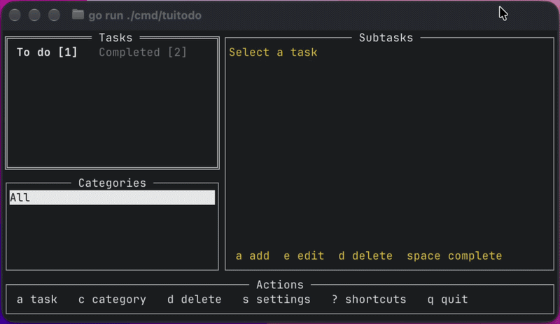

# tuitodo - a tui to-do

A simple terminal todo app (Tui). Parent tasks, subtasks, and categories
live on your machine — nothing is sent to a server, and you keep the data.

Language follows the OS (en-US / pt-BR) and can be changed in the app.

## How to use

- [English](docs/en-US/how-to-use.md)
- [Portuguese (Brazil)](docs/pt-BR/how-to-use.md)
